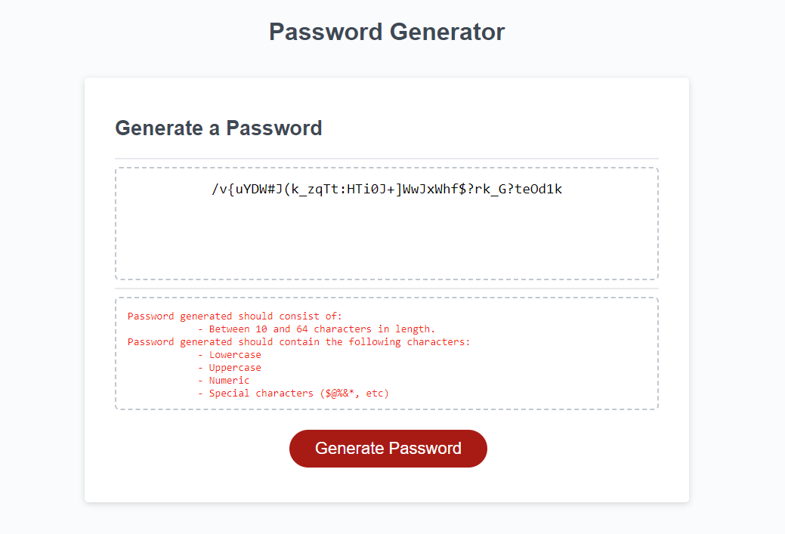
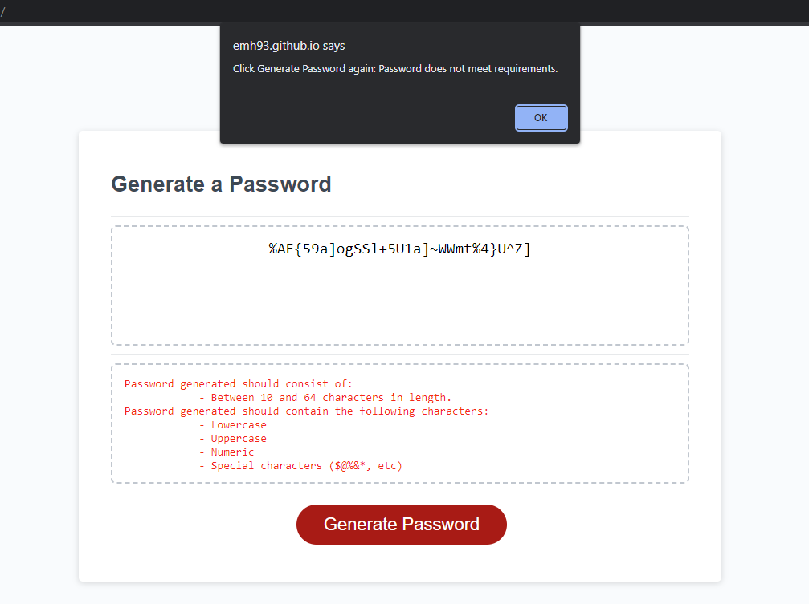
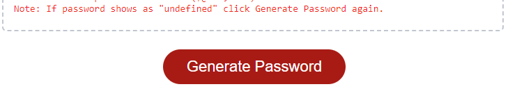

# <Random-Password-Generator>

## Description

This project was intended to make a random password generator that produces a password that meets set parameters. As well as this the application needed to adapt to the users viewport via media queries in css. 

This project was intended to help me practice the creation of functions, methods and working between html, css and javascript, - as none of my projects until now have combined all three to such an extent. This password generator tries to produce a password that is secure as possible by making sure the password is made at a random length between 10 and 64 characters, as well as including a random number of upper case, lower case, numeric and special characters. If the generated password does not match the required length and complexity, the browser returns an alert and prompts the user to hit generate button again.

I enjoyed learning how to hide and show a block using javascript functions and found learning how the .addEventListener method works - which is all new to me.

## Installation

Live deployed web application can be viewed via the following link: https://emh93.github.io/Random-Password-Generator/
Click "Generate Password" to begin generating randomised passwords.

## Usage

Deployed application can be accessed by the url above. When opening the web page the user will be presented with the default web page, waiting for the user to begin, as shown below:

Once the user clicks on the red "Generate Password" button, they will be presented with a list of parameters that the password must meet in order to be effective - the password generated by the randomiser will always create one within these parameters per the javascript code. Clicking the generate button will then present a randomised password for the user in place of the placeholder text. An example password and the prompts visuals are shown below:

In the instance that the password generated by the randomiser does not meet the requirements shown, the user will be shown an alert prompt that will ask them to press Generate Password again, this ensures they are given a password that is sufficently secure. The alert is shown below:

Once the user presses "Confirm" on the alert, the password will show as "undefined", but clicking the "Generate Password" button will produce a new password when clicked. The user is prompted to click again both by the alert and in the prompt box on screen, as shown below:

## Credits

Starter JS, HTML, CSS files provided by edX front end web development bootcamp.
Hiding and showing block function used from w3schools.com

## License

MIT license
