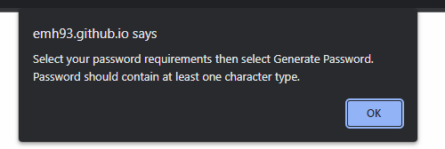

# <Random-Password-Generator>

## Description

This project was intended to make a random password generator that produces a password that meets parameters set by the user. As well as this the application needed to adapt to the users viewport via media queries in css. 

This project was intended to help me practice the creation of functions, methods and working between html, css and javascript, - as none of my projects until now have combined all three to such an extent. This password generator allows the user to configure the length and contents of the random password generated, with the use of a slider and check boxes. If the user does not select any of the checkboxes, the generator will return an error asking them to select at least one character type.

I struggled a bit with this project as originally I built the wrong kind of password generator, that didn't allow the user to pick the inputs, so reworking the code and trying to wrap my head around how to calibrate the user input was all very new to me.

## Installation

Live deployed web application can be viewed via the following link: https://emh93.github.io/Random-Password-Generator/
Select the password length and character requirements and then click "Generate Password" to begin generating randomised passwords.

## Usage

The deployed application can be accessed by the url above. When opening the web page the user will be presented with a pop up alert that explains the rules of the generator to them, as shown below:

Once the pop up is closed they will encounter the main screen, the placeholder text in the password box instructs them to click the generate password button, and as default the generator is set to the minimum length of 10 and all character types are selected.

The user can then select their password length and character requirements and select "Generate Password", the password will then be shown in the password box, as shown below:

If the user doesn't select any character types, they'll be presented with the following on screen error:

## Credits

Starter JS, HTML, CSS files provided by edX front end web development bootcamp.
I followed this tutorial for the configuration functionality, which was key to my understanding: https://webdesign.tutsplus.com/tutorials/build-a-configurable-random-password-generator-with-javascript--cms-93262 

## License

MIT license
